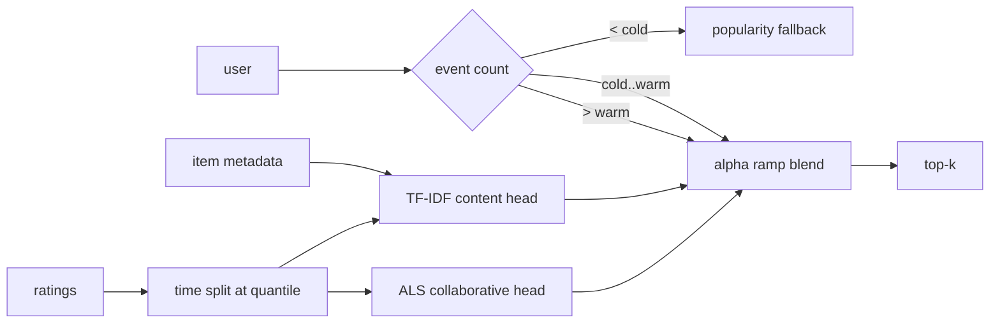

# recommendation-engine — a hybrid recommender that survives cold start

[](https://github.com/darrshangovender/recommendation-engine/actions/workflows/tests.yml)
[](LICENSE)
[](https://python.org)
[](https://numpy.org)

> Four recommenders on MovieLens-100K — popularity, TF-IDF content, implicit ALS, and a hybrid that ramps between the content and collaborative heads based on how much history a user actually has — evaluated on a time-based split with recall, precision, NDCG and catalogue coverage.

## Scope

This is a **public reference implementation**. The production version at the Agulhas Code client (under NDA) serves an e-commerce catalogue with live co-purchase signals and pushes recommendations into their storefront. The reference implementation here reproduces the same architecture — the same two heads, the same history-depth blend, the same evaluation protocol — on MovieLens-100K, which anyone can download and re-run. Commercial impact from that engagement is not published.

**Why this exists.** Cold start is the practical killer for any real recommender. Every catalogue has a long tail of new items and every product has a long tail of new users. A pure collaborative model is silent on both. A pure content model handles cold start but loses the "people who bought X also bought Y" signal that actually drives basket size. The hybrid is boring engineering, and it is the design that wins in production.

---

## Quick start

```bash
make install
make eval        # downloads MovieLens-100K, runs all four models, prints the table
```

```python
from recommender.data.loader import load_movielens_100k, time_split
from recommender.models import HybridRecommender
from recommender.evaluation import evaluate

data = load_movielens_100k()                       # cached under ~/.recommender_cache
train, test = time_split(data.ratings, test_frac=0.2)

hybrid = HybridRecommender(
    cold_threshold=5, warm_threshold=30, warm_alpha=0.3, candidate_pool=200,
).fit(train, items=data.items)

print(hybrid.recommend(user_id=1, k=10, exclude_seen=True))

res = evaluate(hybrid, train, test, k=10,
               catalog_size=int(data.items["item_id"].nunique()),
               user_sample=300, seed=42)
print(res.as_row())
```

Or run the whole comparison:

```python
from recommender import Pipeline
print(Pipeline(k=10, test_frac=0.2, user_sample=300, seed=42).run(data).table().to_string(index=False))
```

No metric table is published in this README. `make eval` produces one on your machine against the dataset you downloaded — see the last limitation for why the numbers this README used to carry were removed.

## How it works



1. `load_movielens_100k()` downloads and caches the dataset into ratings, items and users frames.
2. `time_split()` cuts at the timestamp quantile, so evaluation is genuinely forward-looking rather than a random shuffle across time.
3. The content head builds TF-IDF vectors over genres and titles; a user profile is the mean of the items they rated at or above the positive threshold.
4. The collaborative head fits implicit ALS over the interaction matrix.
5. At request time, the user's event count picks a blend weight — pure content when cold, mostly collaborative when warm, a linear ramp between.
6. A candidate pool is drawn from both heads, each head scores it, scores are min-max rescaled, and the weighted sum ranks the result.
7. Users below the cold threshold, or unknown entirely, fall back to global popularity.

## The four models

| Model | Needs | Handles cold start | Notes |
|---|---|---|---|
| `PopularityRecommender` | ratings only | trivially | Global count ranking. The baseline every recommender must beat, and the fallback the hybrid lands on. |
| `ContentRecommender` | item metadata | **yes** | TF-IDF over genres and title; profile is the mean of positively-rated items |
| `CollabALSRecommender` | interactions | no | Implicit ALS, 64 factors. Uses the `implicit` library if installed, otherwise a pure-NumPy solver |
| `HybridRecommender` | both | yes | Per-user alpha ramp on event count; popularity fallback below the cold threshold |

Evaluation reports recall@k, precision@k, NDCG@k and catalogue coverage over users present in both splits.

## Design decisions

| Decision | Why |
|---|---|
| **A time split, not a random split** | A random split lets the model see the future, and every recommender looks excellent when it can. The timestamp quantile is the only honest cut. |
| **Popularity as a first-class model, not a footnote** | It is genuinely hard to beat on recall, and a hybrid that can't beat it is telling you something. It also has to exist as the cold-start floor. |
| **The blend ramps on history depth, not a fixed weight** | A fixed 70/30 split is wrong for both a first-session user and a power user. The whole point of the hybrid is that the right weight is a function of what you know about the person. |
| **A pure-NumPy ALS fallback** | `implicit` needs a compiler and doesn't install cleanly everywhere. The fallback means `make eval` works on a fresh machine, and the fast path is one extra install away. |
| **Catalogue coverage alongside accuracy** | A recommender that shows everyone the same twenty items scores fine on recall and is worthless commercially. |

## Limitations

- **The default ALS solver is a Python row-loop, not `implicit`.** It calls `np.linalg.solve` once per row per half-iteration — on MovieLens-100K that is tens of thousands of interpreter-level solves. `implicit` is an optional extra and the backend **silently degrades** to NumPy when it's missing, with no warning. Install `.[als]` for anything beyond a demo.
- **The hybrid swallows all head failures silently.** Both head calls are wrapped in bare `except Exception: pass`. An unfitted model, a bad id, or a real bug degrades to a popularity fallback with no log line and no signal to the caller — so the system's most common failure mode looks like a working recommender returning bland results.
- **Hybrid scores are only comparable within a single call.** The min-max rescale is computed against the item list passed in, so scores can't be thresholded across requests or users, and a constant vector collapses to all zeros. There is no calibrated relevance number here.
- **`recall@k` is capped recall.** It divides by `min(len(truth), k)`, which reports higher than textbook recall@k for users with more than `k` test items. The number is internally consistent for comparing the four models against each other; it is **not** comparable to published baselines.
- **Everything is in-memory and per-process.** No model implements save or load. There is no serving layer, no cache, and no persistence anywhere in the repo — fitting is the only way to get a scorer.
- **There is no implicit-feedback event weighting, no time decay, and no negative sampling.** ALS is fed the raw explicit rating. The previous version of this README described co-purchase-over-co-view weighting, six-month exponential decay, and frequency-corrected negative sampling; none of that exists in the code, and all three would be real work.
- **`make bench` is broken** — the target points at a `benchmarks/` directory that does not exist.
- **The previously published offline numbers have been removed.** This README cited `recall@10: 0.41` against a `0.18` rule-based baseline, sub-100ms p95 serve latency, and commercial lift. The command that produced the recall figure does not exist in the repo, there is no serving code to measure latency against, and no results artifact is committed. Run `make eval` for numbers you can trace.

## Project layout

```
recommendation-engine/
├── recommender/
│   ├── data/loader.py    # MovieLens download + cache + time_split
│   ├── models/
│   │   ├── popularity.py # global count baseline / cold-start fallback
│   │   ├── content.py    # TF-IDF over genres + title
│   │   ├── collab_als.py # implicit ALS with a NumPy fallback backend
│   │   ├── _als_numpy.py # pure-NumPy Hu/Koren/Volinsky solver
│   │   └── hybrid.py     # candidate pool + alpha ramp blend
│   ├── evaluation.py     # recall · precision · NDCG · coverage
│   └── pipeline.py       # fit all four, produce the comparison table
├── tests/                # 43 tests (one network test, skipped by default)
└── Makefile              # install · data · test · eval
```

## Tests

```bash
make test        # 43 tests; the network test skips unless RECOMMENDER_NETWORK_TESTS=1
```

The metric implementations are pinned against closed-form expected values, which matters because a subtly wrong NDCG is invisible in a results table. CI runs the suite on every push.

## Author

Darrshan Govender · [Agulhas Code](https://agulhascode.co.za) · Durban, South Africa
